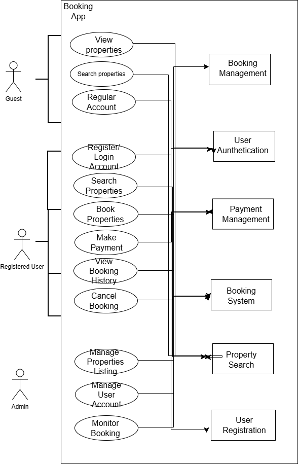

# Requirement Analysis in Software Development
This repository contains documentation about requirement analysis in software development. It explains how to gather, analyze, and validate software requirements effectively.
## What is Requirement Analysis?
**Clear understanding of needs:** Ensures developers and stakeholders are on the same page.
- **Reduced errors and costs:** Detecting requirement issues early prevents expensive mistakes later.
- **Better project planning:** Helps estimate time, resources, and scope accurately.
- **Improved product quality:** Leads to software that meets user expectations and business goals.
- **Enhanced communication:** Serves as a reference document for all team members throughout the SDLC.
## Why is Requirement Analysis Important?
Requirement Analysis is a crucial step in the Software Development Life Cycle (SDLC) because it ensures that software projects are planned and executed effectively. Key reasons include:

1. **Clarifies project objectives:**  
   Requirement Analysis ensures that the needs and expectations of stakeholders are clearly understood, reducing misunderstandings during development.

2. **Reduces project risks and costs:**  
   By identifying potential issues early, teams can prevent costly mistakes, avoid rework, and keep the project on schedule and within budget.

3. **Improves product quality:**  
   A thorough requirement analysis results in software that better meets user needs, functions correctly, and provides a more reliable and usable product.

4. **Facilitates better communication:**  
   It provides a reference document that all team members can follow, keeping everyone aligned throughout the SDLC.
   ## Key Activities in Requirement Analysis
   Requirement Analysis involves several key activities that help ensure software meets stakeholder needs:

- **Requirement Gathering:**  
  Collecting all relevant information from stakeholders, users, and other sources to understand the overall needs and objectives of the software project.

- **Requirement Elicitation:**  
  Using techniques like interviews, surveys, brainstorming, and observation to uncover both explicit and implicit requirements from stakeholders.

- **Requirement Documentation:**  
  Recording the gathered requirements in a structured format, such as requirement specification documents, use cases, or user stories, to serve as a reference throughout the SDLC.

- **Requirement Analysis and Modeling:**  
  Organizing and examining the requirements to identify conflicts, gaps, or ambiguities. Creating models like data flow diagrams, UML diagrams, or prototypes to visualize the system.

- **Requirement Validation:**  
  Reviewing and verifying the requirements with stakeholders to ensure accuracy, completeness, and alignment with business goals before development begins.
## Types of Requirements
### Functional Requirements
Functional requirements describe **what the system should do** — the specific features or functions that the software must provide.

**Examples for a Booking Management Project:**
- Users can create, update, and cancel bookings.
- Admins can approve or reject booking requests.
- System sends email notifications when a booking is confirmed.
- Users can search for available time slots based on date and service type.
- Reports can be generated for daily or monthly bookings.
### Non-functional Requirements
Non-functional requirements describe **how the system performs** or the quality attributes the system must have. They define constraints and standards for the system.

**Examples for a Booking Management Project:**
- System should load booking pages within 2 seconds (Performance).  
- Data must be encrypted to ensure user privacy (Security).  
- The application should be accessible on both desktop and mobile devices (Usability).  
- The system should be available 99.9% of the time (Reliability).  
- The system should be able to handle up to 500 simultaneous users (Scalability).
## Use Case Diagrams
A **Use Case Diagram** is a visual representation of the interactions between **users (actors)** and a system. It helps stakeholders and developers understand the functional requirements of the system and how users interact with it.

**Benefits of Use Case Diagrams:**
- Provides a clear visualization of system functionality.
- Helps identify all possible interactions between users and the system.
- Facilitates communication between developers and stakeholders.
- Supports requirement validation by showing expected system behavior
### Booking System Use Case Diagram
The main **actors** in the booking system are:  
- User  
- Admin 
The key **use cases** include:  
- Create Booking  
- Update Booking  
- Cancel Booking  
- Approve/Reject Booking  
- Generate Reports  
- Send Notifications 

## Acceptance Criteria
**Acceptance Criteria** are the conditions that a software product must satisfy to be accepted by the stakeholders, ensuring that the feature works as intended. They provide clear guidelines for developers, testers, and stakeholders to confirm that the requirements have been met.

**Importance of Acceptance Criteria in Requirement Analysis:**
- Clarifies the expected behavior of features before development begins.
- Helps avoid misunderstandings between stakeholders and developers.
- Provides a basis for testing and validation of features.
- Ensures that all functional and non-functional requirements are met.

**Example: Acceptance Criteria for the Checkout Feature in a Booking Management System**
- Users can review their booking details before confirming payment.  
- The system accepts valid payment methods (credit card, debit card, or digital wallet).  
- Successful payment generates a confirmation message and sends an email notification to the user.  
- If payment fails, the system displays an error message and does not finalize the booking.  
- The booking details are saved in the system after successful payment.